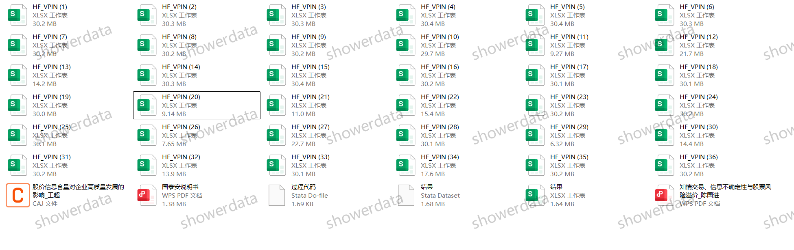
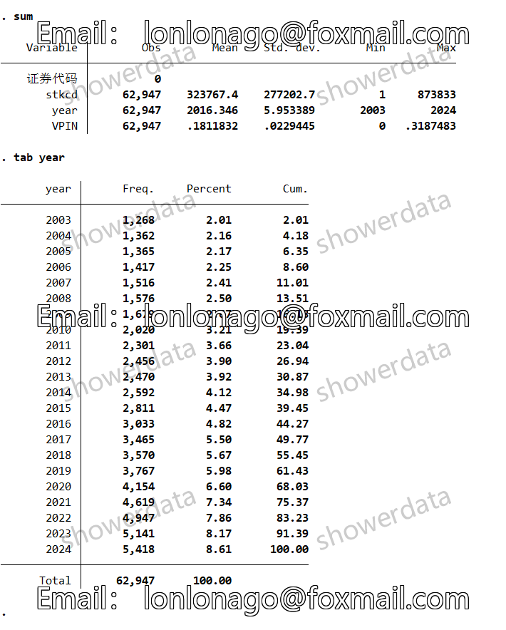
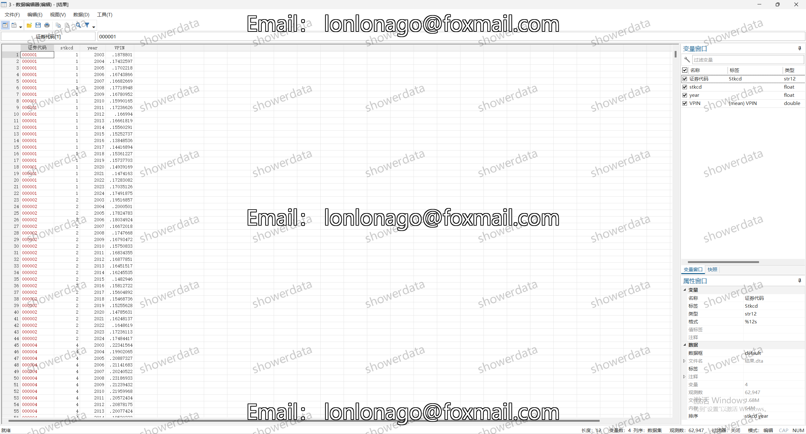

## Body

2003-2024年企业知情交易概率数据VPIN

一、数据介绍
Data Name: Enterprise Informed Trading Probability Data VPIN
Sample Scope: A Gu Shang Company, 62947 observations (unexcluded)
Time Scope: 2003-2024
Data Formats: Dta, Excel
Data Content: Raw data, references, do codes (simplified arrangement, raw data is already calculated), Excel and Dta results (unexcluded)

二、Data Results Metrics as shown in the figure below
Calculated by Chen Guojin's method in 2019, larger VPIN indicates more asymmetric information.

## Images

Here is a pay link on Stripe ( https://buy.stripe.com/3cs8yP7sY87d0vu9AB ). Please contact me lonlonago@foxmail.com after funding $89, and I will send you a complete data files , thank you!

